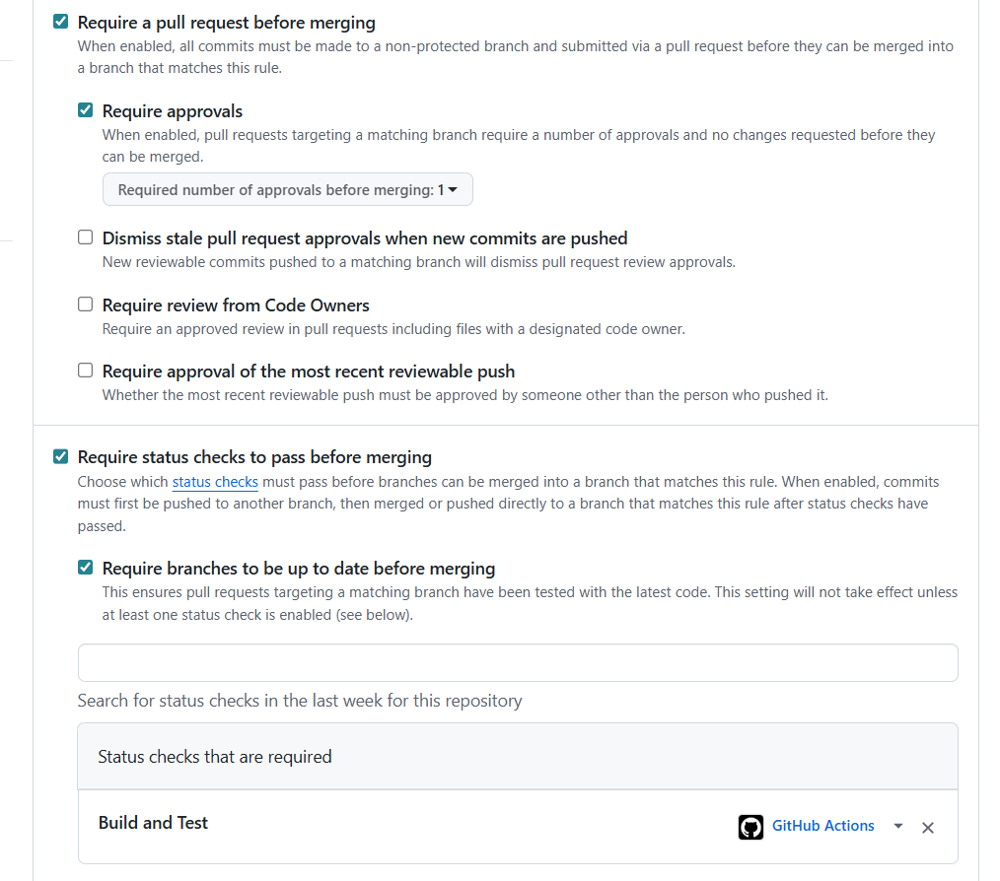

# Branch Protection Rules — ElectroView

---

## Rules Enforced on `main`

| Rule | What it does |
|---|---|
| Require pull request before merging | No direct pushes to `main`. All changes go through a PR, creating a permanent record of what changed and why. |
| Require 1 approving review | At least one other team member must read and approve the change before it can merge. Catches bugs the author missed and spreads knowledge across the team. |
| Require status checks (`Build and Test`) to pass | The CI workflow must succeed. If any unit or integration test fails, the merge button is disabled. |
| Require branches to be up to date | Forces the PR author to rebase or merge in the latest `main` before merging. Prevents "works on my branch but breaks main" surprises. |
| Disallow bypassing settings | Even administrators cannot override these rules. The protection is enforced uniformly. |

---

## Why Each Rule Matters

### Pull Request Requirement
Without PRs, anyone could push broken or untested code directly to `main`,
breaking the build for the entire team. PRs create a structured, reviewable
unit of change that documents intent, scope, and reasoning. They also enable
discussion before merging, not after.

### Review Requirement
Code review is the cheapest, most effective way to catch defects. A second
pair of eyes finds bugs the author missed, questions decisions the author
took for granted, and ensures more than one person on the team understands
each part of the system. This protects against the "bus factor" problem,
if one developer leaves, the team still understands the code they wrote.

### Status Check Requirement
The CI pipeline runs every unit and integration test on every PR. Without
this gate, a PR could be merged while tests are still failing, breaking
`main` and blocking everyone else. Making CI a required check means the
team's tests function as a safety net rather than a suggestion.

### Branch Up-to-Date Requirement
Without this, a PR can pass CI in isolation but break `main` because of a
change someone else merged in the meantime. Requiring the branch to be up
to date forces the author to integrate the latest `main` into their branch
and re-run CI against the combined code, catching integration conflicts
before they reach `main`.

### No Bypass
Allowing administrators to override the rules creates a back door that
defeats the purpose of having rules. If the rules are correct, they should
apply to everyone. If they're wrong, they should be changed for everyone.

---

## How a Change Reaches `main`

1. Developer creates a feature branch from `main`
2. Developer commits and pushes changes to that branch
3. Developer opens a Pull Request targeting `main`
4. GitHub Actions automatically runs the CI workflow on the PR
5. Another team member reviews and approves the PR
6. Once both checks pass (1 approval + CI green), the merge button enables
7. Developer merges; GitHub Actions builds the release JAR artifact

If any step fails, the PR cannot merge. This is the entire point,
broken code cannot reach `main`, and broken code cannot break the team.

---

## Screenshot

The configured rules on GitHub:

