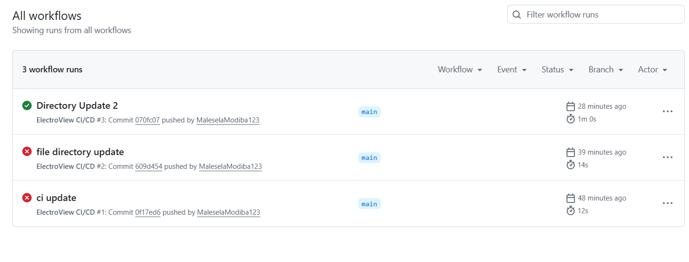
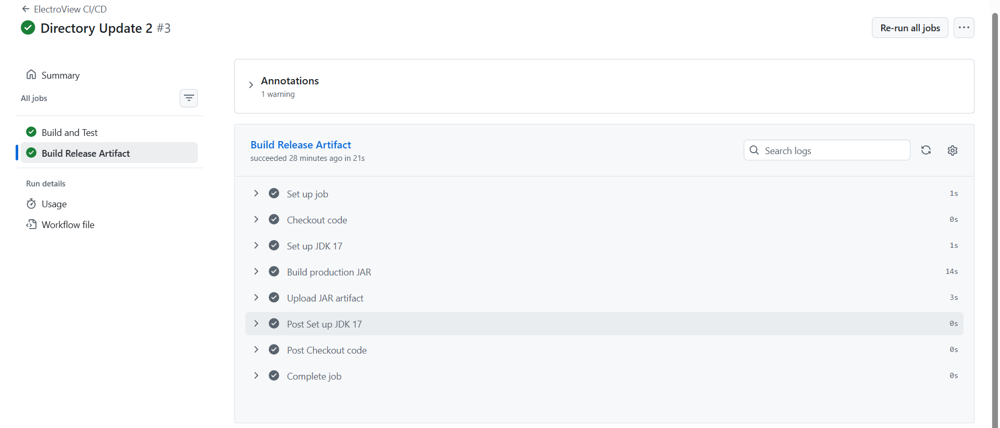

# ElectroView - Electricity Usage Analytics Dashboard

ElectroView is a real-time data analytics dashboard application for monitoring and analysing electricity consumption across residential and municipal infrastructure. The system takes in meter readings, visualises usage patterns, detects anomalies, and generates reports to support informed decisions by utility providers and end-users.

Once completed, ElectroView will provide:
- Live electricity consumption monitoring per zone/household
- Historical trend analysis and forecasting
- Anomaly and fault detection alerts
- Usage reports exportable for billing and auditing
- Role-based access for administrators, analysts, and consumers

---

## Project Documents

[Specification](./Specification.md) Full system specification including domain, problem statement, scope, functional and non-functional requirements, and use cases.

[Architecture](./Architecture.md) C4 architectural diagrams (Context, Container, Component, Code) with Mermaid source.

[Stakeholders](./Stakeholders.md) Stakeholder analysis: 7 stakeholders with roles, key concerns, pain points, success metrics, and conflict mapping.

[System Requirements Document](./SRD.md) System Requirements Document: 12 functional requirements with acceptance criteria + 14 non-functional requirements across 6 quality categories.

[Use Cases](./UseCases.md) UML use case diagram (Mermaid), actor descriptions, 8 detailed use case specifications with flows and alternative flows.

[Test Cases](./TestCases.md) Functional test cases + non-functional test cases.

[Agile Planning](./Agile_Planning.md) 12 user stories (INVEST-compliant), MoSCoW-prioritised product backlog, Sprint 1 plan with 22 tasks.

[Reflection](./Reflection.md) Reflection on challenges faced in the documentation of the project.

[Template Analysis](./template_analysis.md) Comparison of 4 GitHub project templates with justification for selecting Team Planning.

[Kanban Explanation](./kanban_explanation.md) Kanban board definition, 7-column design rationale, WIP limits, and README section for the board.

[State Diagrams](./State_Diagrams.md) State transition diagrams for 8 objects: User Account, Meter Reading, Anomaly, Consumption Report, Zone, Smart Meter, Consumer Budget, User Session.

[Activity Diagrams](./Activity_Diagram.md) Activity diagrams for 8 workflows: Login, Meter Ingestion, Anomaly Resolution, Consumer Dashboard, Report Export, Threshold Config, User Management, Executive KPI.

[Domain Model](./Domain_Model.md) 7 domain entities with attributes, methods, relationships, and 10 business rules.

[Class Diagram](./Class_Diagram.md) Full Mermaid.js class diagram with enumerations, 8 domain classes, 3 service boundary classes, multiplicity, composition, and design decision explanations.

[Repository Class Diagram](./Repository_Class_Diagram.md) This diagram shows the persistence repository layer. It demonstrates the Repository pattern with multiple swappable storage backends, accessed through a Factory abstraction mechanism.

[OpenAPI/Swagger file](./Swagger.md) Interactive API documentation is available via Swagger UI when the application is running: http://localhost:8080/swagger-ui.html

---

## ElectroView Project

### Language and Framework

| Item | Choice |
|---|---|
| Language | Java 17 |
| Framework | Spring Boot 3.2.3 |
| Database | MySQL (production) |
| ORM | Spring Data JPA / Hibernate |
| Boilerplate reduction | Lombok |
| Testing | JUnit 5, Mockito |
| Build tool | Maven |

## Getting Started

New here? See [Contributing.md](./Contributing.md) for full setup instructions.
Quick version:

```bash
git clone https://github.com/YOUR-USERNAME/ElectoView.git
cd ElectoView/electroview
mvn clean install
mvn spring-boot:run
```

Then open http://localhost:8080/swagger-ui.html

## Features for Contribution

We welcome contributors! Here are areas where help is wanted:

| Feature | Difficulty | Label |
|---|---|---|
| Complete FileSystem repository (JSON storage) | Medium | `good-first-issue` |
| Add validation messages to API error responses | Easy | `good-first-issue` |
| Implement PDF report rendering | Medium | `feature-request` |
| Add Redis caching for zone summaries | Hard | `feature-request` |
| Wire up real email alerts (SendGrid) | Medium | `feature-request` |
| Add more integration tests for Anomaly endpoints | Easy | `good-first-issue` |

See the full [Road_Map.md](./Road_Map.md) for the bigger picture.

## License

This project is licensed under the MIT License — see [LICENSE](./LICENSE).

---

### Creational Design Patterns

| Pattern | Class | ElectroView Use Case |
|---|---|---|
| Simple Factory | `NotificationFactory` | Creates ANOMALY_ALERT, BUDGET_WARNING, and REPORT_READY notifications from one central place — prevents scattered `new` calls across the codebase |
| Factory Method | `ReportExporter` → `PdfReportExporter` / `CsvReportExporter` | PDF and CSV exports share the same validation and processing workflow but differ in file production — subclasses decide the output format |
| Abstract Factory | `DashboardComponentFactory` → `AdminDashboardFactory` / `ConsumerDashboardFactory` | Each role gets a matching family of components — Admins get zone overview charts and anomaly panels, Consumers get personal usage charts and budget panels |
| Builder | `ReportRequest.Builder` | Report requests have two mandatory fields and several optional ones — the Builder enforces the mandatory fields and makes optional configuration readable |
| Prototype | `ZoneTemplateCache` + `ZonePrototype.clone()` | New zones are cloned from pre-configured RESIDENTIAL, INDUSTRIAL, or MIXED_USE templates instead of being configured from scratch each time |
| Singleton | `DatabaseConnectionManager` | One thread-safe connection pool is shared globally — multiple instances would exhaust database connections |

---
### API Endpoints

#### Users `/api/users`
| Method | URL | Description |
|---|---|---|
| POST | `/api/users` | Create a new user |
| GET | `/api/users` | Get all users |
| GET | `/api/users/{id}` | Get user by ID |
| PATCH | `/api/users/{id}/activate` | Activate account |
| PATCH | `/api/users/{id}/deactivate` | Deactivate account |
| PATCH | `/api/users/{id}/unlock` | Unlock locked account |
| PATCH | `/api/users/{id}/role` | Update user role |
| PATCH | `/api/users/{id}/password` | Reset password |

#### Zones `/api/zones`
| Method | URL | Description |
|---|---|---|
| POST | `/api/zones` | Create a zone |
| GET | `/api/zones` | Get all zones |
| GET | `/api/zones/{id}` | Get zone by ID |
| GET | `/api/zones/active` | Get all active zones |
| PATCH | `/api/zones/{id}/activate` | Activate zone |
| PATCH | `/api/zones/{id}/deactivate` | Deactivate zone |
| PATCH | `/api/zones/{id}/threshold` | Update anomaly threshold |
| PATCH | `/api/zones/{id}/status` | Refresh zone status |

#### Meters `/api/meters`
| Method | URL | Description |
|---|---|---|
| POST | `/api/meters` | Register a meter |
| GET | `/api/meters` | Get all meters |
| GET | `/api/meters/{id}` | Get meter by ID |
| GET | `/api/meters/zone/{zoneId}` | Get meters in a zone |
| GET | `/api/meters/status/{status}` | Get meters by status |
| PATCH | `/api/meters/{id}/activate` | Activate meter |
| PATCH | `/api/meters/{id}/deactivate` | Deactivate meter |
| PATCH | `/api/meters/{id}/decommission` | Decommission meter |
| PATCH | `/api/meters/{id}/consumer` | Assign consumer to meter |

#### Readings `/api/readings`
| Method | URL | Description |
|---|---|---|
| POST | `/api/readings` | Ingest a meter reading |
| GET | `/api/readings/meter/{meterId}` | Get readings for a meter |
| GET | `/api/readings/meter/{meterId}/range` | Get readings in date range |
| GET | `/api/readings/anomalous` | Get all anomalous readings |

#### Anomalies `/api/anomalies`
| Method | URL | Description |
|---|---|---|
| GET | `/api/anomalies` | Get all anomalies |
| GET | `/api/anomalies/{id}` | Get anomaly by ID |
| GET | `/api/anomalies/status/{status}` | Get by status |
| GET | `/api/anomalies/meter/{meterId}` | Get by meter |
| GET | `/api/anomalies/count/open` | Count open anomalies |
| PATCH | `/api/anomalies/{id}/assign` | Assign to user |
| PATCH | `/api/anomalies/{id}/resolve` | Resolve anomaly |
| PATCH | `/api/anomalies/{id}/escalate` | Escalate anomaly |
| PATCH | `/api/anomalies/{id}/auto-resolve` | Auto-resolve anomaly |

#### Reports `/api/reports`
| Method | URL | Description |
|---|---|---|
| POST | `/api/reports` | Request a report |
| GET | `/api/reports/{id}` | Get report by ID |
| GET | `/api/reports/user/{userId}` | Get reports by user |
| GET | `/api/reports/status/{status}` | Get reports by status |
| PATCH | `/api/reports/{id}/purge` | Purge expired report |

#### Dashboard `/api/dashboard`
| Method | URL | Description |
|---|---|---|
| POST | `/api/dashboard/zones/{zoneId}/summarise` | Compute daily summary |
| GET | `/api/dashboard/zones/{zoneId}/summaries` | Get all zone summaries |
| GET | `/api/dashboard/zones/{zoneId}/summaries/range` | Get summaries in range |

### Test Results

| Test Class | Tests | What is verified |
|---|---|---|
| `UserServiceTest` | 9 | Account creation, lockout, activation, password reset |
| `ZoneServiceTest` | 7 | Zone creation, threshold updates, status changes |
| `MeterServiceTest` | 6 | Registration, activation, decommission, consumer assignment |
| `AnomalyServiceTest` | 9 | Create, assign, resolve, escalate, auto-resolve, count |
| `ReportServiceTest` | 6 | Inline vs queued reports, invalid date range, find by user |
| `NotificationFactoryTest` | 9 | Type correctness, message content, mark-as-read, unique IDs |
| `ReportExporterTest` | 8 | MIME type, CSV header, file naming, empty and null data |
| `DashboardComponentFactoryTest` | 7 | Chart type, alert panel capacity, role family isolation |
| `ReportRequestBuilderTest` | 7 | Minimal build, full build, invalid inputs, null dates |
| `ZonePrototypeTest` | 7 | Config equality, unique IDs, clone independence, cache |
| `DatabaseConnectionManagerTest` | 8 | Same instance, pool exhaustion, thread safety, shutdown |

---

## CI/CD with GitHub Actions

ElectroView uses GitHub Actions for continuous integration and continuous
delivery. Every code change is automatically built, tested, and (when
merged to `main`) packaged as a deployable JAR.

### Running Tests Locally

Before pushing, you can run the same tests the CI pipeline will run:

```bash
cd electroview
mvn test
```

To build the production JAR locally:

```bash
mvn clean package
```

The JAR will be created at `target/electroview-1.0-SNAPSHOT.jar`.

### How the CI/CD Pipeline Works

The workflow lives in `.github/workflows/ci.yml` and runs two jobs:

| Job | Triggered by | What it does |
|---|---|---|
| **Build and Test** | Every push and every PR to `main` | Sets up Java 17, compiles, runs all unit and integration tests, uploads test reports |
| **Build Release Artifact** | Only pushes to `main` (after tests pass) | Builds the production JAR and uploads it as a downloadable artifact |

The release job has `needs: test` so it never runs if the test job fails.
The release job has `if: github.ref == 'refs/heads/main'` so it never runs
on feature branches — only when code lands on `main`.

### Branch Protection

The `main` branch is protected. See [PROTECTION.md](./PROTECTION.md) for the
full set of rules and the reasoning behind each one.

In short:
- No direct pushes to `main` — everything goes through a PR
- Tests must pass before a PR can be merged
- At least one reviewer must approve before a PR can be merged

### Test Workflow Status



### Generated JAR Artifact

After a successful merge to `main`, the JAR appears in the run summary
under the **Artifacts** section, ready to download or deploy.



## Project Board

ElectroView uses a GitHub Project (Team Planning template) as its Agile Kanban board.
The board tracks all user stories and sprint tasks across seven columns:

Backlog → Ready → In Progress → Testing → Blocked → Done

Two custom columns were added beyond the default template:
- **Testing** — ensures all tasks pass the test cases defined in TEST_CASES.md
  before entering code review, making QA a visible and mandatory workflow stage.
- **Blocked** — surfaces tasks that cannot proceed due to dependencies or unresolved
  decisions, separating them from active work to keep WIP counts accurate.

WIP limits: In Progress (max 4), Testing (max 3).
All Sprint 1 issues are linked to the milestone: Sprint 1 — MVP Foundation.

.png>)
.png>)

---

## Tech Stack (Planned — Frontend)

| Layer | Technology |
|---|---|
| Language | Java 17 |
| Framework | Spring Boot 3.2.3 |
| Web | Spring MVC (REST controllers) |
| Persistence | Spring Data JPA / Hibernate |
| Database | MySQL 8.0 (production), H2 (integration tests) |
| Boilerplate reduction | Lombok |
| API documentation | SpringDoc OpenAPI / Swagger UI |
| Testing | JUnit 5, Mockito, Spring Boot Test |
| Build | Maven |
| CI/CD | GitHub Actions |
| Version control | Git / GitHub |

---