# Repository Layer Class Diagram

This diagram shows the persistence repository layer.
It demonstrates the Repository pattern with multiple swappable storage
backends, accessed through a Factory abstraction mechanism.

---

## Full Class Diagram

```mermaid
classDiagram
    %% ─────────────────────────────────────────
    %% Generic Repository Interface
    %% ─────────────────────────────────────────
    class Repository~T, ID~ {
        <<interface>>
        +save(T entity) T
        +findById(ID id) Optional~T~
        +findAll() List~T~
        +deleteById(ID id) void
        +delete(T entity) void
        +existsById(ID id) boolean
        +count() long
    }

    %% ─────────────────────────────────────────
    %% Entity-Specific Repository Interfaces
    %% ─────────────────────────────────────────
    class UserRepositoryI {
        <<interface>>
        +findByEmail(String email) Optional~User~
        +findByRole(Role role) List~User~
        +findByStatus(AccountStatus status) List~User~
        +existsByEmail(String email) boolean
    }

    class ZoneRepositoryI {
        <<interface>>
        +findByStatus(ZoneStatus status) List~Zone~
        +existsByName(String name) boolean
    }

    class MeterRepositoryI {
        <<interface>>
        +findByZoneId(String zoneId) List~Meter~
        +findByStatus(MeterStatus status) List~Meter~
        +findBySerialNumber(String serial) Optional~Meter~
        +findByConsumerId(String id) List~Meter~
        +existsBySerialNumber(String serial) boolean
    }

    class ReadingRepositoryI {
        <<interface>>
        +findByMeterId(String meterId) List~Reading~
        +findByMeterIdAndRecordedAtBetween(...) List~Reading~
        +findAnomalous() List~Reading~
    }

    class AnomalyRepositoryI {
        <<interface>>
        +findByMeterId(String meterId) List~Anomaly~
        +findByStatus(AnomalyStatus status) List~Anomaly~
        +findByAssignedTo(String userId) List~Anomaly~
        +countByStatus(AnomalyStatus status) long
    }

    class ReportRepositoryI {
        <<interface>>
        +findByRequestedBy(String userId) List~Report~
        +findByStatus(ReportStatus status) List~Report~
        +findByZoneId(String zoneId) List~Report~
    }

    class DailySummaryRepositoryI {
        <<interface>>
        +findByZoneId(String zoneId) List~DailySummary~
        +findByZoneIdAndSummaryDate(...) Optional~DailySummary~
        +findByZoneIdAndSummaryDateBetween(...) List~DailySummary~
    }

    %% ─────────────────────────────────────────
    %% In-Memory Implementations
    %% ─────────────────────────────────────────
    class InMemoryUserRepository {
        -storage : Map~String, User~
        +save(User) User
        +findById(String) Optional~User~
        +findByEmail(String) Optional~User~
        +findByRole(Role) List~User~
    }

    class InMemoryZoneRepository {
        -storage : Map~String, Zone~
    }

    class InMemoryMeterRepository {
        -storage : Map~String, Meter~
    }

    class InMemoryReadingRepository {
        -storage : Map~String, Reading~
    }

    class InMemoryAnomalyRepository {
        -storage : Map~String, Anomaly~
    }

    class InMemoryReportRepository {
        -storage : Map~String, Report~
    }

    class InMemoryDailySummaryRepository {
        -storage : Map~String, DailySummary~
    }

    %% ─────────────────────────────────────────
    %% Filesystem Stub (Future Implementation)
    %% ─────────────────────────────────────────
    class FileSystemUserRepository {
        -filePath : String
        +save(User) User
        +findById(String) Optional~User~
        +findByEmail(String) Optional~User~
    }

    %% ─────────────────────────────────────────
    %% Factory and Storage Type Enum
    %% ─────────────────────────────────────────
    class StorageType {
        <<enumeration>>
        IN_MEMORY
        FILE_SYSTEM
        DATABASE
    }

    class RepositoryFactory {
        <<utility>>
        +getUserRepository(StorageType) UserRepositoryI
        +getZoneRepository(StorageType) ZoneRepositoryI
        +getMeterRepository(StorageType) MeterRepositoryI
        +getReadingRepository(StorageType) ReadingRepositoryI
        +getAnomalyRepository(StorageType) AnomalyRepositoryI
        +getReportRepository(StorageType) ReportRepositoryI
        +getDailySummaryRepository(StorageType) DailySummaryRepositoryI
    }

    %% ─────────────────────────────────────────
    %% Inheritance — Entity-specific extends Generic
    %% ─────────────────────────────────────────
    Repository <|-- UserRepositoryI
    Repository <|-- ZoneRepositoryI
    Repository <|-- MeterRepositoryI
    Repository <|-- ReadingRepositoryI
    Repository <|-- AnomalyRepositoryI
    Repository <|-- ReportRepositoryI
    Repository <|-- DailySummaryRepositoryI

    %% ─────────────────────────────────────────
    %% Realisation — Implementations realise interfaces
    %% ─────────────────────────────────────────
    UserRepositoryI <|.. InMemoryUserRepository
    UserRepositoryI <|.. FileSystemUserRepository
    ZoneRepositoryI <|.. InMemoryZoneRepository
    MeterRepositoryI <|.. InMemoryMeterRepository
    ReadingRepositoryI <|.. InMemoryReadingRepository
    AnomalyRepositoryI <|.. InMemoryAnomalyRepository
    ReportRepositoryI <|.. InMemoryReportRepository
    DailySummaryRepositoryI <|.. InMemoryDailySummaryRepository

    %% ─────────────────────────────────────────
    %% Factory creates implementations
    %% ─────────────────────────────────────────
    RepositoryFactory ..> InMemoryUserRepository : creates
    RepositoryFactory ..> InMemoryZoneRepository : creates
    RepositoryFactory ..> InMemoryMeterRepository : creates
    RepositoryFactory ..> InMemoryReadingRepository : creates
    RepositoryFactory ..> InMemoryAnomalyRepository : creates
    RepositoryFactory ..> InMemoryReportRepository : creates
    RepositoryFactory ..> InMemoryDailySummaryRepository : creates
    RepositoryFactory ..> FileSystemUserRepository : creates
    RepositoryFactory ..> StorageType : uses
```

---

## Key Design Decisions

### 1. Generic Repository at the Top

The `Repository<T, ID>` interface defines all CRUD operations once using
generics. Every entity-specific interface inherits these methods automatically,
eliminating seven duplicate copies of `save`, `findById`, `findAll`,
`deleteById`, `delete`, `existsById`, and `count`.

### 2. Entity-Specific Interfaces Add Domain Queries

Generic CRUD is not enough for real applications. `UserRepositoryI` adds
`findByEmail` because the User domain requires it. `MeterRepositoryI` adds
`findByZoneId` because zone-scoped queries are central to the dashboard.
These methods stay on the interface — not the implementation — so any
backend can satisfy the contract.

### 3. Multiple Implementations per Interface

`UserRepositoryI` has two implementations shown:
- `InMemoryUserRepository` — production-ready, used in tests
- `FileSystemUserRepository` — stub demonstrating future-proofing

The other six interfaces have one implementation each but the pattern is
the same — additional backends plug into the same interface contract
without modifying any consumer code.

### 4. Factory as the Single Point of Variation

`RepositoryFactory` is the only class that knows about concrete
implementations. Service classes never import `InMemoryUserRepository`
directly — they receive a `UserRepositoryI` reference and call its
methods. To swap backends, only the factory call changes.

### 5. StorageType Enum Bounds the Choices

Using an enum for storage type means:
- The compiler enforces only valid types are passed
- Adding a new backend requires adding both a new enum value and a new
  case in the factory — neither change can be forgotten
- Documentation (the enum values themselves) tells you what backends exist